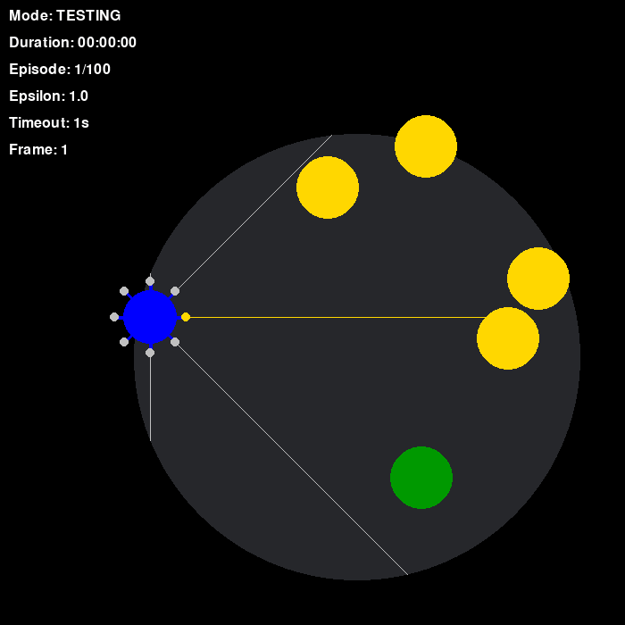

# Star Collector Reinforcement Learning Project

## What's This Project All About?

I've been working on this project to level up my skills in reinforcement learning and machine learning in general. The main goal was to teach a DQN (Deep Q-Network) agent to play "Star Collector." It was a fun and challenging journey, and I learned a ton along the way.

### About Star Collector

#### The Rules of the Game

"Star Collector" is pretty straightforward: you've got this agent whose mission is to grab as many stars as possible and finally take the green exit door.

#### Why It's Tougher Than It Looks in this implementation

- The agent can only see what's directly around it, not the whole board. So, it's like playing blindfolded and having to make the best move.
- Time? The agent doesn't know either. It just knows what's happening right now and how many stars it has.
- No two games are the same because the stars get placed randomly every time. This keeps the agent on its toes.

## Why I Did This

To be honest, this project is more for kicks and learning than anything else. It was a great way to get hands-on experience with reinforcement learning, but I'm not planning to turn it into something big.

### Evaluation of Results

Given the complexity of the problem, especially considering the limited state information available to the DQN agent for learning, the results obtained are highly satisfactory, albeit imperfect. Please refer to the examples provided above for a more detailed understanding of the agent's performance.

### Getting Started

If you're curious and want to mess around with it yourself, here's how to get the ball rolling:

#### What You Need

Check out the `requirements.txt` file—it's got all the packages you need to run the clients and the server.

#### Setting Things Up

First off, install all the dependencies:

`pip install -r requirements.txt`

#### Running the Show

Make sure you start the server before the clients. You need to restart the server for each new training round (kinda annoying, I know).

**Server Side:**

Get the Flask server up with:

`flask --app main run --debug --no-reload`

**Client Time:**

Head over to the ./client directory and run:

`python main.py`

**TensorBoard for the Wins:**

To see how your training's doing, launch TensorBoard from the ./flask-server directory:

`tensorboard --logdir=./tensorflow/`

And that's pretty much it! Dive in, play around, and see how you can make the agent smarter at collecting stars.

### Model Testing and Output

Currently, the process of model testing involves saving game sessions as GIF files in the `/tmp/` directory of the user's system. It is imperative to retrieve these files prior to any system reset by Linux/macOS, as such resets will result in the deletion of the data stored in this temporary directory.
